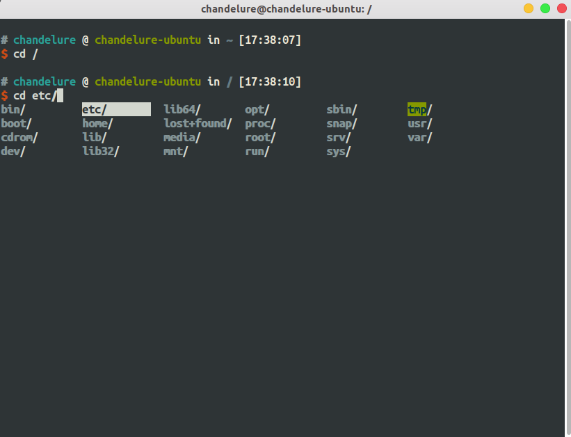

# Chandezsh
## Introduction

chandezsh is a configrations for zsh based on oh-my-zsh. It is easy to install/update/uninstall zsh configration in Linux. 

Now [chandezsh](https://github/chandelures/chandezsh.git) is in development phase...

## Screenshot



## Requirements

chandevim is require `git` ,  `zsh`  and  `oh-my-zsh` . You should install them earliest.

## Install

**Please ensure the zsh and oh-my-zsh had been installed.**

### Linux

```shell
git clone https://github.com/chandelures/chandevim.git
cd chandevim
./chandevim.sh --install
```

## Usage

### Help

#### Linux

```shell
cd chande
./chandevim.sh --help
```

### Update

#### Linux

```shell
cd chandevim
./chandevim.sh --update
```

### Uninstall

#### Linux

```shell
cd chandevim
./chandevim.sh --remove
```

